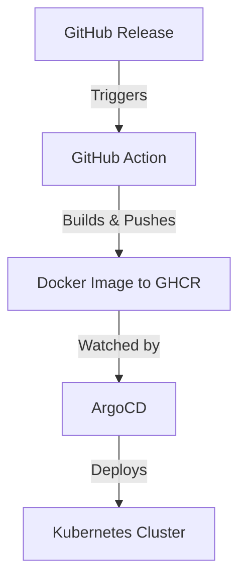

# ArgoCD Application for RSS Serve

This directory contains the ArgoCD Application manifest for deploying RSS Serve to Kubernetes using GitOps.

## Files

- `rss-serve-application.yaml` - ArgoCD Application manifest

## Deployment Workflow



## Setup Instructions

### 1. Apply the ArgoCD Application

```bash
kubectl apply -f argocd/rss-serve-application.yaml
```

### 2. Access ArgoCD UI

The application will appear in your ArgoCD dashboard under the name `rss-serve`.

### 3. Update Deployments

When you want to deploy a new version:

1. **Create a GitHub Release** with a semantic version tag (e.g., `v1.2.3`)
2. **Update the ArgoCD Application** to point to the new version:

```yaml
# In kustomize/overlays/production/kustomization.yaml
images:
  - name: ghcr.io/hugis/rss-serve
    newTag: v1.2.3  # Update this to your new version
```

3. **Commit and Push** the changes - ArgoCD will automatically detect and deploy

## Configuration Details

### ArgoCD Application Spec

- **Source Repository**: `https://github.com/hugis/rss-serve.git`
- **Path**: `kustomize/overlays/production`
- **Destination**: `rss-serve` namespace (auto-created)
- **Sync Policy**: Automatic with self-healing and pruning
- **Kustomize Plugin**: Uses built-in Kustomize support

### Synchronization Behavior

- **Automatic Sync**: Enabled by default
- **Self-Healing**: ArgoCD will correct any manual changes
- **Pruning**: Removes resources that are no longer in the manifests
- **Retry Logic**: 5 attempts with exponential backoff

## Monitoring and Troubleshooting

### Check Application Status

```bash
argocd app get rss-serve
argocd app logs rss-serve
```

### Manual Sync (if needed)

```bash
argocd app sync rss-serve
```

### View Resources

```bash
argocd app resources rss-serve
```

## Rollback Procedure

If you need to rollback to a previous version:

1. Update the image tag in `kustomize/overlays/production/kustomization.yaml` to the previous version
2. Commit and push the changes
3. ArgoCD will automatically rollback the deployment

## Integration with GitHub Actions

The workflow integrates seamlessly:

1. **GitHub Action** builds and tags Docker images when releases are created
2. **ArgoCD** monitors the Git repository for changes
3. **Kustomize** handles environment-specific configuration
4. **Cloudflare Tunnel** provides secure ingress

This setup provides a complete GitOps pipeline from code to production!